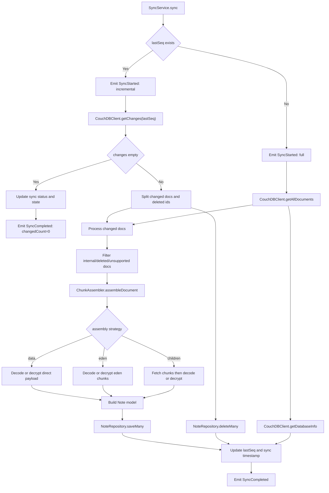
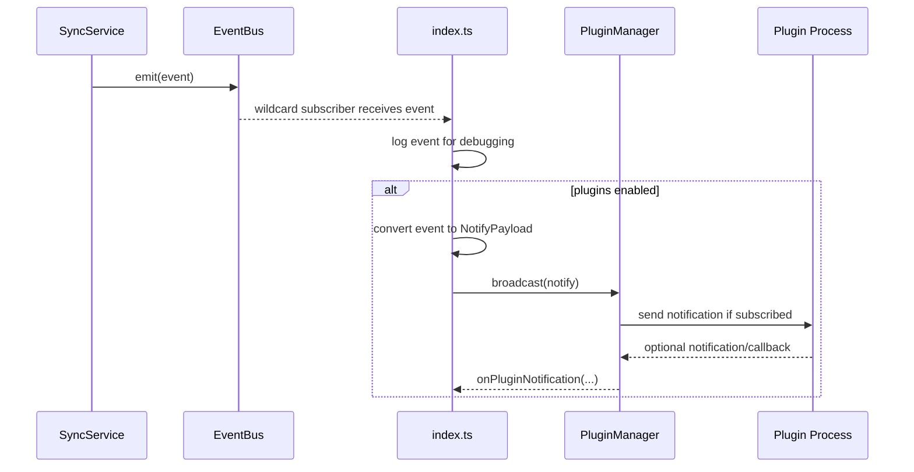

# 项目结构说明

## 目的

这份文档用于快速说明仓库结构、运行时模块关系，以及典型请求和同步过程中的数据流，帮助新读者尽快建立整体认知。

## 启动流程

运行时入口是 `src/index.ts`。

启动顺序如下：

1. 通过 `src/utils/config.ts` 加载环境变量配置。
2. 创建 `CouchDBClient`，建立对 CouchDB 的访问能力。
3. 启动前先测试 CouchDB 连通性。
4. 初始化 `JsonFileStorage`，用于保存 `lastSeq` 等同步状态。
5. 创建 `ChunkAssembler`，负责组装并解密 LiveSync 文档内容。
6. 创建 `DiskNoteRepository`，将组装完成的笔记写入 `VAULT_PATH`。
7. 创建事件总线，并按配置决定是否启动插件系统。
8. 创建 `SyncService`，恢复同步状态，并按配置决定是否开启自动同步。
9. 创建 Fastify 应用并注册 `/api` 路由。

可以把 `src/index.ts` 看作整个应用的装配根。真正的同步逻辑、存储逻辑和事件流转，分别分布在 `services`、`core`、`repositories`、`storage` 和 `plugins` 中。

## 目录职责

### `src/`

主应用源码目录。理解项目时，绝大多数核心逻辑都从这里展开。

### `src/index.ts`

服务进程入口。

建议先看这个文件，因为它最能说明：
- 应用启动时会实例化哪些组件
- 配置如何注入到各个模块
- 默认启用了哪些运行能力
- API、同步、存储、插件之间是如何被接起来的

### `src/debug-sync.ts`

一次性同步调试入口，不启动 HTTP 服务，只执行单次同步和结果检查。

适合用于：
- 验证 CouchDB 连接是否正常
- 验证解密链路是否正常
- 检查同步后的笔记内容是否符合预期

### `src/api/`

HTTP 接口层，基于 Fastify。

当前职责很薄，主要是：
- 注册 `/api` 路由
- 做少量请求参数校验
- 把具体业务委托给 `SyncService`

这一层应尽量保持轻量，避免把业务逻辑堆进路由处理器。

### `src/core/`

底层同步能力和共享抽象所在目录。

关键文件：
- `couchdb-client.ts`：封装 CouchDB 访问、批量获取文档、changes feed 等能力
- `chunk-assembler.ts`：根据 `data`、`eden`、`children` 三种形式还原文档内容
- `event-bus.ts`：提供进程内事件分发能力
- `interfaces.ts`：定义 `IDocumentAssembler`、`IDocumentStorage`、`IStateStorage` 等核心接口

这一层最接近 LiveSync 的实际数据模型，是“原始存储结构”和“上层业务服务”之间的桥梁。

### `src/services/`

业务编排层。

目前核心是 `sync-service.ts`，主要负责：
- 决定执行全量同步还是增量同步
- 从 CouchDB 读取文档或变更
- 调用 `ChunkAssembler` 组装内容
- 将 LiveSync 文档转换为内部 `Note` 模型
- 把结果写入 `NoteRepository`
- 更新持久化同步状态
- 发出同步相关领域事件

后续如果有跨多个模块的功能，一般都应该从 `services/` 发起组织，而不是直接塞进 `api/` 或 `core/`。

### `src/repositories/`

已组装笔记的存储抽象层。

关键文件：
- `note-repository.ts`：统一的仓储接口
- `memory-note-repository.ts`：内存实现，适合测试或轻量场景
- `disk-note-repository.ts`：磁盘实现，当前主程序默认使用

这一层存放的是最终可读的笔记内容，不直接处理 CouchDB 原始文档。

### `src/storage/`

应用状态持久化层，不负责保存笔记正文。

当前实现：
- `json-file-storage.ts`：把 `lastSeq`、最近同步时间等状态保存到本地 JSON 文件

它和 `repositories/` 分开，是因为“同步状态”和“笔记数据”生命周期不同，访问模式也不同。

### `src/plugins/`

插件运行时与宿主集成层。

关键文件：
- `plugin-manager.ts`：插件生命周期管理与事件广播
- `plugin-process.ts`：子进程级别的插件通信
- `types.ts`：插件协议与配置类型
- `debug-plugin.ts`：本地调试插件入口
- `test-fixtures/`：用于测试的模拟插件

这是一个可选子系统。如果没有加载插件配置，主程序会跳过插件启动。

### `src/utils/`

通用工具模块。

关键文件：
- `config.ts`：读取环境变量并生成结构化配置
- `logger.ts`：共享 Pino 日志实例
- `livesync-crypto.ts`：LiveSync 的 HKDF 解密实现
- `encryption.ts`：补充加解密工具

这类模块应保持通用，不直接承载核心业务流程。

### `src/types/`

跨目录共享的 TypeScript 类型定义。

包括：
- 应用配置类型
- LiveSync 文档结构
- `Note` 模型
- 同步状态
- 事件类型

只要某个类型会被多个层复用，通常就应该放在这里。

### `docs/`

项目文档目录。

目前包含：
- 总体概览文档
- CouchDB 拉取相关说明
- 插件相关说明
- `docs/archive/` 下的历史规划与实现记录

这份 `project-struct.md` 更偏 onboarding 地图，用来帮助理解项目，而不是替代详细设计文档。

### 根目录基础设施文件

几个重要的顶层文件：
- `package.json`：脚本、依赖、构建和运行入口
- `plugins.config.json`：插件配置来源
- `Dockerfile`：容器镜像构建
- `docker-compose.yml`：本地或服务器部署编排
- `Caddyfile`：反向代理配置
- `tsconfig.json`：TypeScript 编译配置
- `vitest.config.ts`：测试运行配置

## 典型流程

### 同步流

全量同步和增量同步可以放在同一条主流程里理解，区别主要在于“文档来源”和“是否处理删除记录”：

补充说明：
- 全量同步的文档来源是 `getAllDocuments()`，并在完成后通过 `getDatabaseInfo()` 读取最新 `update_seq`。
- 增量同步的文档来源是 `getChanges(lastSeq)`，会额外处理删除记录。
- 两条路径都会复用同一套文档过滤、分片组装、解密、落盘和状态持久化逻辑。
- 如果增量同步没有任何变更，仍然会更新同步状态，并发出一个 `changedCount: 0` 的 `SyncCompleted` 事件。

### 事件流

同步过程中的事件链路可以表示为：

当前 `SyncService` 已发出的同步相关事件包括：
- `SyncStarted`
- `SyncCompleted`
- `SyncFailed`

事件本身包含的信息主要有：
- 事件类型
- 时间戳
- 来源模块，当前为 `SyncService`
- 同步元数据，例如 `documentsCount`、`lastSeq`、`lastSyncSuccess`

这种设计把插件能力和同步核心解耦开了。同步逻辑不需要了解具体插件实现，但插件仍然可以对同步状态变化作出响应。

## 建议阅读顺序

如果是第一次接触这个项目，建议按下面顺序阅读：

1. `README.md`
2. `docs/Project-Overview.md`
3. `src/index.ts`
4. `src/services/sync-service.ts`
5. `src/core/couchdb-client.ts`
6. `src/core/chunk-assembler.ts`
7. `src/repositories/disk-note-repository.ts`
8. `src/api/routes.ts`
9. `src/plugins/plugin-manager.ts`

这个顺序基本对应运行时主路径：先看启动装配，再看同步编排，再看底层数据访问与内容组装，最后看 API 暴露层和插件扩展点。
